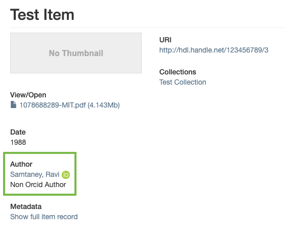
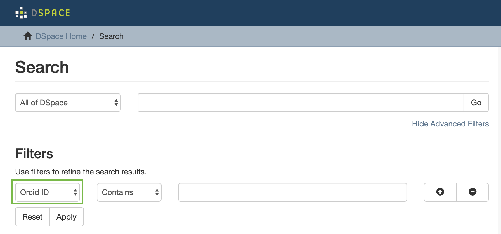

# Functionality overview

This patch encompasses an expansion of the default DSpace REST API, item display and discovery features that allow for additional ORCID functionalities to be made available. 

## Viewing Authorities and ORCID IDs in the REST API

The ORCID patch makes it possible to view authorities and ORCID IDs on an item through the DSpace REST API . Both the authority and ORCID information are exposed as part of the author metadata field in the following way: 

```bash
{author name}::{authority key}::{ORCID ID}
```

For example, for an author named Test, Author, who is linked to the authority key  e095211a53a5964eb982c27c55282215 and has ORCID ID 0000-0002-9315-2622, the information displayed would look as follows: 

```bash
Test, Author::e095211a53a5964eb982c27c55282215::0000-0002-9315-2622
```

## Adding Authorities and ORCID IDs through the REST API

Next to viewing authorities and ORCID IDs on an existing item, this patch also makes it possible to add authorities and ORCID IDs to these items through the REST API. To enable this feature, both the PUT and POST endpoint have been updated. 

### Adding Authors with a Specified Authority

To update an existing item with an additional author that already has an authority key assigned, the following syntax can be used:

```bash
{author name}::{authority key}
```

For adding the Test, Author and his authority key, this would look like like this:

```bash
Test, Author::e095211a53a5964eb982c27c55282215
```

In case the authority value that was specified is not found, the author name will still be added to the item but without the authority. When the authority value is found, on the contrary, both the author name and attached authority key will be added to the item to ensure a consistent display of metadata in the repository. 

### Adding Authors with a Specified ORCID ID

To update an existing item with an additional author and his ORCID ID, the following syntax can be used:

```bash
{author name}::{ORCID}
```

For adding the Test, Author value and his ORCID ID, this would look like this:

```bash
Test, Author::0000-0002-9315-2622
```

When the ORCID ID that was specified is not found, the author name and ORCID ID will still be added to the item. A new authority will be created with this ORCID ID. When the ORCID ID is immediately found, on the contrary, DSpace will add the author name, ORCID ID and the existing authority key to the item in question. 

### Adding Authors without Authority or ORCID ID Specified

It is also possible to update an existing item with an additional author without specifying that author’s authority key or ORCID ID. In such cases, only the author name is sent in through the REST API. When the API passes on such an author name without any additional information to DSpace, the result will be different depending on the matches DSpace will find on the string name of that author:

* If an exact string name match is found on an existing authority record that does not have an ORCID, the author will get linked to this existing non-ORCID authority record. Both the author name and his authority key will be added to the item. 
* If an exact string name match is found on an existing authority record that does have an ORCID, the author will not get linked to the existing ORCID authority. A new non-ORCID authority will be created. The author name and the newly created authority will be added to the item. 
* If no exact string name match is found on an existing authority, the author will not get linked to any existing authority record. A new non-ORCID authority will be created. The author name and the newly created authority will be added to the item. 

## Display of the ORCID ID Icon on the item page

This ORCID patch will trigger the appearance of the ORCID icon behind authors that have been linked to an ORCID authority on the simple item page. When a user clicks this icon, he/she will be redirected to the ORCID profile page of that specific author.



## Advanced Search on ORCID ID

After installation of this ORCID patch, users will be able to search DSpace via an advanced filter on ORCID ID. As any other filter, this ORCID filter is available from the discovery menu. It can be selected in the dropdown menu that is shown after clicking “Show Advanced Filters”. 



This feature is also triggered when the name of an ORCID author is clicked from the simple item page. In those cases, the user will be sent to a discovery page where that author’s ORCID ID is set as a search filter. From there on, he can consult all other items that are linked to the same ORCID ID.


